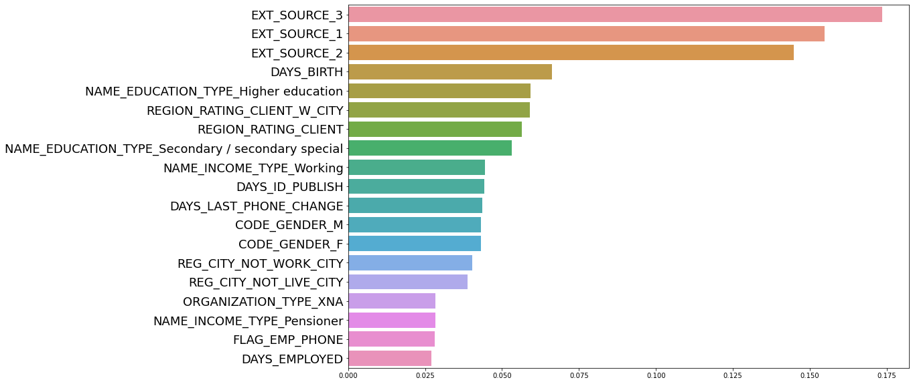
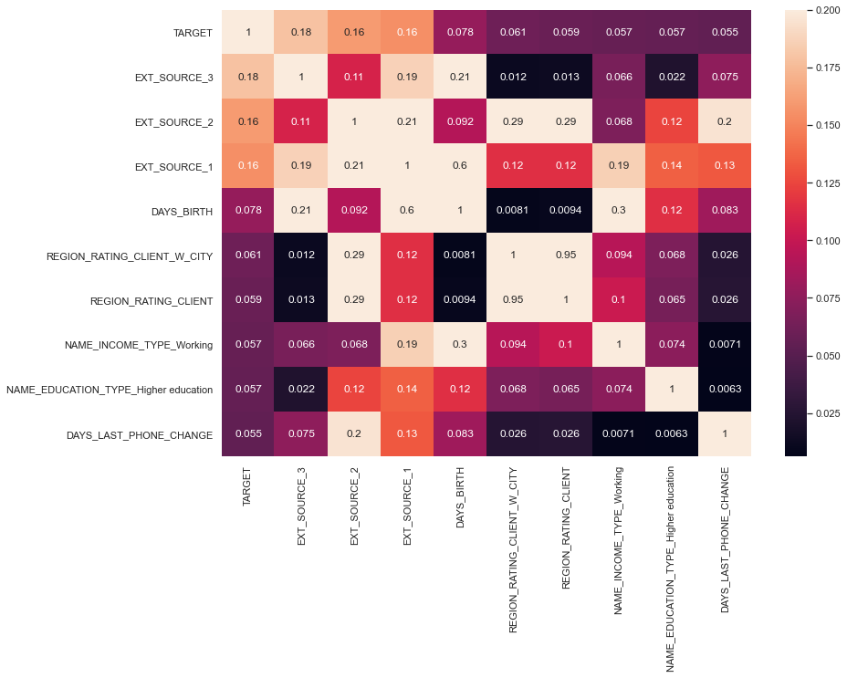
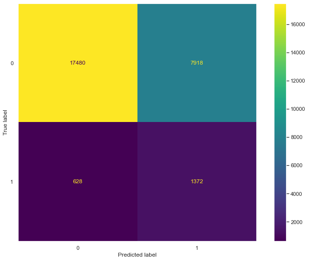

## Final Project Submission

#### Please fill out:

Student name: Yeonjae Zhang

Student pace: full time

Scheduled project review date/time: April 22nd, 2022 Friday

Instructor name: Praveen Gowtham

Blog post URL: https://msyeon.blogspot.com/2022/04/imbalance-data-treatment.html

# Overview
Banks lose moneys from loan defaulters. I will build a prediction model of loan defaulter. This model will help banks to reduce loan default risk.

# Data Understanding
Look into the given data.

<table border="1" class="dataframe">
  <thead>
    <tr style="text-align: right;">
      <th></th>
      <th>SK_ID_CURR</th>
      <th>TARGET</th>
      <th>NAME_CONTRACT_TYPE</th>
      <th>CODE_GENDER</th>
      <th>FLAG_OWN_CAR</th>
      <th>FLAG_OWN_REALTY</th>
      <th>CNT_CHILDREN</th>
      <th>AMT_INCOME_TOTAL</th>
      <th>AMT_CREDIT</th>
      <th>AMT_ANNUITY</th>
      <th>AMT_GOODS_PRICE</th>
      <th>NAME_TYPE_SUITE</th>
      <th>NAME_INCOME_TYPE</th>
      <th>NAME_EDUCATION_TYPE</th>
      <th>NAME_FAMILY_STATUS</th>
      <th>NAME_HOUSING_TYPE</th>
      <th>REGION_POPULATION_RELATIVE</th>
      <th>DAYS_BIRTH</th>
      <th>DAYS_EMPLOYED</th>
      <th>DAYS_REGISTRATION</th>
      <th>DAYS_ID_PUBLISH</th>
      <th>OWN_CAR_AGE</th>
      <th>FLAG_MOBIL</th>
      <th>FLAG_EMP_PHONE</th>
      <th>FLAG_WORK_PHONE</th>
      <th>FLAG_CONT_MOBILE</th>
      <th>FLAG_PHONE</th>
      <th>FLAG_EMAIL</th>
      <th>OCCUPATION_TYPE</th>
      <th>CNT_FAM_MEMBERS</th>
      <th>REGION_RATING_CLIENT</th>
      <th>REGION_RATING_CLIENT_W_CITY</th>
      <th>WEEKDAY_APPR_PROCESS_START</th>
      <th>HOUR_APPR_PROCESS_START</th>
      <th>REG_REGION_NOT_LIVE_REGION</th>
      <th>REG_REGION_NOT_WORK_REGION</th>
      <th>LIVE_REGION_NOT_WORK_REGION</th>
      <th>REG_CITY_NOT_LIVE_CITY</th>
      <th>REG_CITY_NOT_WORK_CITY</th>
      <th>LIVE_CITY_NOT_WORK_CITY</th>
      <th>ORGANIZATION_TYPE</th>
      <th>EXT_SOURCE_1</th>
      <th>EXT_SOURCE_2</th>
      <th>EXT_SOURCE_3</th>
      <th>APARTMENTS_AVG</th>
      <th>BASEMENTAREA_AVG</th>
      <th>YEARS_BEGINEXPLUATATION_AVG</th>
      <th>YEARS_BUILD_AVG</th>
      <th>COMMONAREA_AVG</th>
      <th>ELEVATORS_AVG</th>
      <th>ENTRANCES_AVG</th>
      <th>FLOORSMAX_AVG</th>
      <th>FLOORSMIN_AVG</th>
      <th>LANDAREA_AVG</th>
      <th>LIVINGAPARTMENTS_AVG</th>
      <th>LIVINGAREA_AVG</th>
      <th>NONLIVINGAPARTMENTS_AVG</th>
      <th>NONLIVINGAREA_AVG</th>
      <th>APARTMENTS_MODE</th>
      <th>BASEMENTAREA_MODE</th>
      <th>YEARS_BEGINEXPLUATATION_MODE</th>
      <th>YEARS_BUILD_MODE</th>
      <th>COMMONAREA_MODE</th>
      <th>ELEVATORS_MODE</th>
      <th>ENTRANCES_MODE</th>
      <th>FLOORSMAX_MODE</th>
      <th>FLOORSMIN_MODE</th>
      <th>LANDAREA_MODE</th>
      <th>LIVINGAPARTMENTS_MODE</th>
      <th>LIVINGAREA_MODE</th>
      <th>NONLIVINGAPARTMENTS_MODE</th>
      <th>NONLIVINGAREA_MODE</th>
      <th>APARTMENTS_MEDI</th>
      <th>BASEMENTAREA_MEDI</th>
      <th>YEARS_BEGINEXPLUATATION_MEDI</th>
      <th>YEARS_BUILD_MEDI</th>
      <th>COMMONAREA_MEDI</th>
      <th>ELEVATORS_MEDI</th>
      <th>ENTRANCES_MEDI</th>
      <th>FLOORSMAX_MEDI</th>
      <th>FLOORSMIN_MEDI</th>
      <th>LANDAREA_MEDI</th>
      <th>LIVINGAPARTMENTS_MEDI</th>
      <th>LIVINGAREA_MEDI</th>
      <th>NONLIVINGAPARTMENTS_MEDI</th>
      <th>NONLIVINGAREA_MEDI</th>
      <th>FONDKAPREMONT_MODE</th>
      <th>HOUSETYPE_MODE</th>
      <th>TOTALAREA_MODE</th>
      <th>WALLSMATERIAL_MODE</th>
      <th>EMERGENCYSTATE_MODE</th>
      <th>OBS_30_CNT_SOCIAL_CIRCLE</th>
      <th>DEF_30_CNT_SOCIAL_CIRCLE</th>
      <th>OBS_60_CNT_SOCIAL_CIRCLE</th>
      <th>DEF_60_CNT_SOCIAL_CIRCLE</th>
      <th>DAYS_LAST_PHONE_CHANGE</th>
      <th>FLAG_DOCUMENT_2</th>
      <th>FLAG_DOCUMENT_3</th>
      <th>FLAG_DOCUMENT_4</th>
      <th>FLAG_DOCUMENT_5</th>
      <th>FLAG_DOCUMENT_6</th>
      <th>FLAG_DOCUMENT_7</th>
      <th>FLAG_DOCUMENT_8</th>
      <th>FLAG_DOCUMENT_9</th>
      <th>FLAG_DOCUMENT_10</th>
      <th>FLAG_DOCUMENT_11</th>
      <th>FLAG_DOCUMENT_12</th>
      <th>FLAG_DOCUMENT_13</th>
      <th>FLAG_DOCUMENT_14</th>
      <th>FLAG_DOCUMENT_15</th>
      <th>FLAG_DOCUMENT_16</th>
      <th>FLAG_DOCUMENT_17</th>
      <th>FLAG_DOCUMENT_18</th>
      <th>FLAG_DOCUMENT_19</th>
      <th>FLAG_DOCUMENT_20</th>
      <th>FLAG_DOCUMENT_21</th>
      <th>AMT_REQ_CREDIT_BUREAU_HOUR</th>
      <th>AMT_REQ_CREDIT_BUREAU_DAY</th>
      <th>AMT_REQ_CREDIT_BUREAU_WEEK</th>
      <th>AMT_REQ_CREDIT_BUREAU_MON</th>
      <th>AMT_REQ_CREDIT_BUREAU_QRT</th>
      <th>AMT_REQ_CREDIT_BUREAU_YEAR</th>
    </tr>
  </thead>
  <tbody>
    <tr>
      <th>0</th>
      <td>100002</td>
      <td>1</td>
      <td>Cash loans</td>
      <td>M</td>
      <td>N</td>
      <td>Y</td>
      <td>0</td>
      <td>202500.0</td>
      <td>406597.5</td>
      <td>24700.5</td>
      <td>351000.0</td>
      <td>Unaccompanied</td>
      <td>Working</td>
      <td>Secondary / secondary special</td>
      <td>Single / not married</td>
      <td>House / apartment</td>
      <td>0.018801</td>
      <td>-9461</td>
      <td>-637</td>
      <td>-3648.0</td>
      <td>-2120</td>
      <td>NaN</td>
      <td>1</td>
      <td>1</td>
      <td>0</td>
      <td>1</td>
      <td>1</td>
      <td>0</td>
      <td>Laborers</td>
      <td>1.0</td>
      <td>2</td>
      <td>2</td>
      <td>WEDNESDAY</td>
      <td>10</td>
      <td>0</td>
      <td>0</td>
      <td>0</td>
      <td>0</td>
      <td>0</td>
      <td>0</td>
      <td>Business Entity Type 3</td>
      <td>0.083037</td>
      <td>0.262949</td>
      <td>0.139376</td>
      <td>0.0247</td>
      <td>0.0369</td>
      <td>0.9722</td>
      <td>0.6192</td>
      <td>0.0143</td>
      <td>0.00</td>
      <td>0.0690</td>
      <td>0.0833</td>
      <td>0.1250</td>
      <td>0.0369</td>
      <td>0.0202</td>
      <td>0.0190</td>
      <td>0.0000</td>
      <td>0.0000</td>
      <td>0.0252</td>
      <td>0.0383</td>
      <td>0.9722</td>
      <td>0.6341</td>
      <td>0.0144</td>
      <td>0.0000</td>
      <td>0.0690</td>
      <td>0.0833</td>
      <td>0.1250</td>
      <td>0.0377</td>
      <td>0.022</td>
      <td>0.0198</td>
      <td>0.0</td>
      <td>0.0</td>
      <td>0.0250</td>
      <td>0.0369</td>
      <td>0.9722</td>
      <td>0.6243</td>
      <td>0.0144</td>
      <td>0.00</td>
      <td>0.0690</td>
      <td>0.0833</td>
      <td>0.1250</td>
      <td>0.0375</td>
      <td>0.0205</td>
      <td>0.0193</td>
      <td>0.0000</td>
      <td>0.00</td>
      <td>reg oper account</td>
      <td>block of flats</td>
      <td>0.0149</td>
      <td>Stone, brick</td>
      <td>No</td>
      <td>2.0</td>
      <td>2.0</td>
      <td>2.0</td>
      <td>2.0</td>
      <td>-1134.0</td>
      <td>0</td>
      <td>1</td>
      <td>0</td>
      <td>0</td>
      <td>0</td>
      <td>0</td>
      <td>0</td>
      <td>0</td>
      <td>0</td>
      <td>0</td>
      <td>0</td>
      <td>0</td>
      <td>0</td>
      <td>0</td>
      <td>0</td>
      <td>0</td>
      <td>0</td>
      <td>0</td>
      <td>0</td>
      <td>0</td>
      <td>0.0</td>
      <td>0.0</td>
      <td>0.0</td>
      <td>0.0</td>
      <td>0.0</td>
      <td>1.0</td>
    </tr>
    <tr>
      <th>1</th>
      <td>100003</td>
      <td>0</td>
      <td>Cash loans</td>
      <td>F</td>
      <td>N</td>
      <td>N</td>
      <td>0</td>
      <td>270000.0</td>
      <td>1293502.5</td>
      <td>35698.5</td>
      <td>1129500.0</td>
      <td>Family</td>
      <td>State servant</td>
      <td>Higher education</td>
      <td>Married</td>
      <td>House / apartment</td>
      <td>0.003541</td>
      <td>-16765</td>
      <td>-1188</td>
      <td>-1186.0</td>
      <td>-291</td>
      <td>NaN</td>
      <td>1</td>
      <td>1</td>
      <td>0</td>
      <td>1</td>
      <td>1</td>
      <td>0</td>
      <td>Core staff</td>
      <td>2.0</td>
      <td>1</td>
      <td>1</td>
      <td>MONDAY</td>
      <td>11</td>
      <td>0</td>
      <td>0</td>
      <td>0</td>
      <td>0</td>
      <td>0</td>
      <td>0</td>
      <td>School</td>
      <td>0.311267</td>
      <td>0.622246</td>
      <td>NaN</td>
      <td>0.0959</td>
      <td>0.0529</td>
      <td>0.9851</td>
      <td>0.7960</td>
      <td>0.0605</td>
      <td>0.08</td>
      <td>0.0345</td>
      <td>0.2917</td>
      <td>0.3333</td>
      <td>0.0130</td>
      <td>0.0773</td>
      <td>0.0549</td>
      <td>0.0039</td>
      <td>0.0098</td>
      <td>0.0924</td>
      <td>0.0538</td>
      <td>0.9851</td>
      <td>0.8040</td>
      <td>0.0497</td>
      <td>0.0806</td>
      <td>0.0345</td>
      <td>0.2917</td>
      <td>0.3333</td>
      <td>0.0128</td>
      <td>0.079</td>
      <td>0.0554</td>
      <td>0.0</td>
      <td>0.0</td>
      <td>0.0968</td>
      <td>0.0529</td>
      <td>0.9851</td>
      <td>0.7987</td>
      <td>0.0608</td>
      <td>0.08</td>
      <td>0.0345</td>
      <td>0.2917</td>
      <td>0.3333</td>
      <td>0.0132</td>
      <td>0.0787</td>
      <td>0.0558</td>
      <td>0.0039</td>
      <td>0.01</td>
      <td>reg oper account</td>
      <td>block of flats</td>
      <td>0.0714</td>
      <td>Block</td>
      <td>No</td>
      <td>1.0</td>
      <td>0.0</td>
      <td>1.0</td>
      <td>0.0</td>
      <td>-828.0</td>
      <td>0</td>
      <td>1</td>
      <td>0</td>
      <td>0</td>
      <td>0</td>
      <td>0</td>
      <td>0</td>
      <td>0</td>
      <td>0</td>
      <td>0</td>
      <td>0</td>
      <td>0</td>
      <td>0</td>
      <td>0</td>
      <td>0</td>
      <td>0</td>
      <td>0</td>
      <td>0</td>
      <td>0</td>
      <td>0</td>
      <td>0.0</td>
      <td>0.0</td>
      <td>0.0</td>
      <td>0.0</td>
      <td>0.0</td>
      <td>0.0</td>
    </tr>
    <tr>
      <th>2</th>
      <td>100004</td>
      <td>0</td>
      <td>Revolving loans</td>
      <td>M</td>
      <td>Y</td>
      <td>Y</td>
      <td>0</td>
      <td>67500.0</td>
      <td>135000.0</td>
      <td>6750.0</td>
      <td>135000.0</td>
      <td>Unaccompanied</td>
      <td>Working</td>
      <td>Secondary / secondary special</td>
      <td>Single / not married</td>
      <td>House / apartment</td>
      <td>0.010032</td>
      <td>-19046</td>
      <td>-225</td>
      <td>-4260.0</td>
      <td>-2531</td>
      <td>26.0</td>
      <td>1</td>
      <td>1</td>
      <td>1</td>
      <td>1</td>
      <td>1</td>
      <td>0</td>
      <td>Laborers</td>
      <td>1.0</td>
      <td>2</td>
      <td>2</td>
      <td>MONDAY</td>
      <td>9</td>
      <td>0</td>
      <td>0</td>
      <td>0</td>
      <td>0</td>
      <td>0</td>
      <td>0</td>
      <td>Government</td>
      <td>NaN</td>
      <td>0.555912</td>
      <td>0.729567</td>
      <td>NaN</td>
      <td>NaN</td>
      <td>NaN</td>
      <td>NaN</td>
      <td>NaN</td>
      <td>NaN</td>
      <td>NaN</td>
      <td>NaN</td>
      <td>NaN</td>
      <td>NaN</td>
      <td>NaN</td>
      <td>NaN</td>
      <td>NaN</td>
      <td>NaN</td>
      <td>NaN</td>
      <td>NaN</td>
      <td>NaN</td>
      <td>NaN</td>
      <td>NaN</td>
      <td>NaN</td>
      <td>NaN</td>
      <td>NaN</td>
      <td>NaN</td>
      <td>NaN</td>
      <td>NaN</td>
      <td>NaN</td>
      <td>NaN</td>
      <td>NaN</td>
      <td>NaN</td>
      <td>NaN</td>
      <td>NaN</td>
      <td>NaN</td>
      <td>NaN</td>
      <td>NaN</td>
      <td>NaN</td>
      <td>NaN</td>
      <td>NaN</td>
      <td>NaN</td>
      <td>NaN</td>
      <td>NaN</td>
      <td>NaN</td>
      <td>NaN</td>
      <td>NaN</td>
      <td>NaN</td>
      <td>NaN</td>
      <td>NaN</td>
      <td>NaN</td>
      <td>0.0</td>
      <td>0.0</td>
      <td>0.0</td>
      <td>0.0</td>
      <td>-815.0</td>
      <td>0</td>
      <td>0</td>
      <td>0</td>
      <td>0</td>
      <td>0</td>
      <td>0</td>
      <td>0</td>
      <td>0</td>
      <td>0</td>
      <td>0</td>
      <td>0</td>
      <td>0</td>
      <td>0</td>
      <td>0</td>
      <td>0</td>
      <td>0</td>
      <td>0</td>
      <td>0</td>
      <td>0</td>
      <td>0</td>
      <td>0.0</td>
      <td>0.0</td>
      <td>0.0</td>
      <td>0.0</td>
      <td>0.0</td>
      <td>0.0</td>
    </tr>
    <tr>
      <th>3</th>
      <td>100006</td>
      <td>0</td>
      <td>Cash loans</td>
      <td>F</td>
      <td>N</td>
      <td>Y</td>
      <td>0</td>
      <td>135000.0</td>
      <td>312682.5</td>
      <td>29686.5</td>
      <td>297000.0</td>
      <td>Unaccompanied</td>
      <td>Working</td>
      <td>Secondary / secondary special</td>
      <td>Civil marriage</td>
      <td>House / apartment</td>
      <td>0.008019</td>
      <td>-19005</td>
      <td>-3039</td>
      <td>-9833.0</td>
      <td>-2437</td>
      <td>NaN</td>
      <td>1</td>
      <td>1</td>
      <td>0</td>
      <td>1</td>
      <td>0</td>
      <td>0</td>
      <td>Laborers</td>
      <td>2.0</td>
      <td>2</td>
      <td>2</td>
      <td>WEDNESDAY</td>
      <td>17</td>
      <td>0</td>
      <td>0</td>
      <td>0</td>
      <td>0</td>
      <td>0</td>
      <td>0</td>
      <td>Business Entity Type 3</td>
      <td>NaN</td>
      <td>0.650442</td>
      <td>NaN</td>
      <td>NaN</td>
      <td>NaN</td>
      <td>NaN</td>
      <td>NaN</td>
      <td>NaN</td>
      <td>NaN</td>
      <td>NaN</td>
      <td>NaN</td>
      <td>NaN</td>
      <td>NaN</td>
      <td>NaN</td>
      <td>NaN</td>
      <td>NaN</td>
      <td>NaN</td>
      <td>NaN</td>
      <td>NaN</td>
      <td>NaN</td>
      <td>NaN</td>
      <td>NaN</td>
      <td>NaN</td>
      <td>NaN</td>
      <td>NaN</td>
      <td>NaN</td>
      <td>NaN</td>
      <td>NaN</td>
      <td>NaN</td>
      <td>NaN</td>
      <td>NaN</td>
      <td>NaN</td>
      <td>NaN</td>
      <td>NaN</td>
      <td>NaN</td>
      <td>NaN</td>
      <td>NaN</td>
      <td>NaN</td>
      <td>NaN</td>
      <td>NaN</td>
      <td>NaN</td>
      <td>NaN</td>
      <td>NaN</td>
      <td>NaN</td>
      <td>NaN</td>
      <td>NaN</td>
      <td>NaN</td>
      <td>NaN</td>
      <td>NaN</td>
      <td>NaN</td>
      <td>2.0</td>
      <td>0.0</td>
      <td>2.0</td>
      <td>0.0</td>
      <td>-617.0</td>
      <td>0</td>
      <td>1</td>
      <td>0</td>
      <td>0</td>
      <td>0</td>
      <td>0</td>
      <td>0</td>
      <td>0</td>
      <td>0</td>
      <td>0</td>
      <td>0</td>
      <td>0</td>
      <td>0</td>
      <td>0</td>
      <td>0</td>
      <td>0</td>
      <td>0</td>
      <td>0</td>
      <td>0</td>
      <td>0</td>
      <td>NaN</td>
      <td>NaN</td>
      <td>NaN</td>
      <td>NaN</td>
      <td>NaN</td>
      <td>NaN</td>
    </tr>
    <tr>
      <th>4</th>
      <td>100007</td>
      <td>0</td>
      <td>Cash loans</td>
      <td>M</td>
      <td>N</td>
      <td>Y</td>
      <td>0</td>
      <td>121500.0</td>
      <td>513000.0</td>
      <td>21865.5</td>
      <td>513000.0</td>
      <td>Unaccompanied</td>
      <td>Working</td>
      <td>Secondary / secondary special</td>
      <td>Single / not married</td>
      <td>House / apartment</td>
      <td>0.028663</td>
      <td>-19932</td>
      <td>-3038</td>
      <td>-4311.0</td>
      <td>-3458</td>
      <td>NaN</td>
      <td>1</td>
      <td>1</td>
      <td>0</td>
      <td>1</td>
      <td>0</td>
      <td>0</td>
      <td>Core staff</td>
      <td>1.0</td>
      <td>2</td>
      <td>2</td>
      <td>THURSDAY</td>
      <td>11</td>
      <td>0</td>
      <td>0</td>
      <td>0</td>
      <td>0</td>
      <td>1</td>
      <td>1</td>
      <td>Religion</td>
      <td>NaN</td>
      <td>0.322738</td>
      <td>NaN</td>
      <td>NaN</td>
      <td>NaN</td>
      <td>NaN</td>
      <td>NaN</td>
      <td>NaN</td>
      <td>NaN</td>
      <td>NaN</td>
      <td>NaN</td>
      <td>NaN</td>
      <td>NaN</td>
      <td>NaN</td>
      <td>NaN</td>
      <td>NaN</td>
      <td>NaN</td>
      <td>NaN</td>
      <td>NaN</td>
      <td>NaN</td>
      <td>NaN</td>
      <td>NaN</td>
      <td>NaN</td>
      <td>NaN</td>
      <td>NaN</td>
      <td>NaN</td>
      <td>NaN</td>
      <td>NaN</td>
      <td>NaN</td>
      <td>NaN</td>
      <td>NaN</td>
      <td>NaN</td>
      <td>NaN</td>
      <td>NaN</td>
      <td>NaN</td>
      <td>NaN</td>
      <td>NaN</td>
      <td>NaN</td>
      <td>NaN</td>
      <td>NaN</td>
      <td>NaN</td>
      <td>NaN</td>
      <td>NaN</td>
      <td>NaN</td>
      <td>NaN</td>
      <td>NaN</td>
      <td>NaN</td>
      <td>NaN</td>
      <td>NaN</td>
      <td>NaN</td>
      <td>0.0</td>
      <td>0.0</td>
      <td>0.0</td>
      <td>0.0</td>
      <td>-1106.0</td>
      <td>0</td>
      <td>0</td>
      <td>0</td>
      <td>0</td>
      <td>0</td>
      <td>0</td>
      <td>1</td>
      <td>0</td>
      <td>0</td>
      <td>0</td>
      <td>0</td>
      <td>0</td>
      <td>0</td>
      <td>0</td>
      <td>0</td>
      <td>0</td>
      <td>0</td>
      <td>0</td>
      <td>0</td>
      <td>0</td>
      <td>0.0</td>
      <td>0.0</td>
      <td>0.0</td>
      <td>0.0</td>
      <td>0.0</td>
      <td>0.0</td>
    </tr>
  </tbody>
</table>

There are too many columns and missing values.

<table border="1" class="dataframe">
  <thead>
    <tr style="text-align: right;">
      <th></th>
      <th>SK_ID_CURR</th>
      <th>TARGET</th>
      <th>CNT_CHILDREN</th>
      <th>AMT_INCOME_TOTAL</th>
      <th>AMT_CREDIT</th>
      <th>AMT_ANNUITY</th>
      <th>AMT_GOODS_PRICE</th>
      <th>REGION_POPULATION_RELATIVE</th>
      <th>DAYS_BIRTH</th>
      <th>DAYS_EMPLOYED</th>
      <th>DAYS_REGISTRATION</th>
      <th>DAYS_ID_PUBLISH</th>
      <th>OWN_CAR_AGE</th>
      <th>FLAG_MOBIL</th>
      <th>FLAG_EMP_PHONE</th>
      <th>FLAG_WORK_PHONE</th>
      <th>FLAG_CONT_MOBILE</th>
      <th>FLAG_PHONE</th>
      <th>FLAG_EMAIL</th>
      <th>CNT_FAM_MEMBERS</th>
      <th>REGION_RATING_CLIENT</th>
      <th>REGION_RATING_CLIENT_W_CITY</th>
      <th>HOUR_APPR_PROCESS_START</th>
      <th>REG_REGION_NOT_LIVE_REGION</th>
      <th>REG_REGION_NOT_WORK_REGION</th>
      <th>LIVE_REGION_NOT_WORK_REGION</th>
      <th>REG_CITY_NOT_LIVE_CITY</th>
      <th>REG_CITY_NOT_WORK_CITY</th>
      <th>LIVE_CITY_NOT_WORK_CITY</th>
      <th>EXT_SOURCE_1</th>
      <th>EXT_SOURCE_2</th>
      <th>EXT_SOURCE_3</th>
      <th>APARTMENTS_AVG</th>
      <th>BASEMENTAREA_AVG</th>
      <th>YEARS_BEGINEXPLUATATION_AVG</th>
      <th>YEARS_BUILD_AVG</th>
      <th>COMMONAREA_AVG</th>
      <th>ELEVATORS_AVG</th>
      <th>ENTRANCES_AVG</th>
      <th>FLOORSMAX_AVG</th>
      <th>FLOORSMIN_AVG</th>
      <th>LANDAREA_AVG</th>
      <th>LIVINGAPARTMENTS_AVG</th>
      <th>LIVINGAREA_AVG</th>
      <th>NONLIVINGAPARTMENTS_AVG</th>
      <th>NONLIVINGAREA_AVG</th>
      <th>APARTMENTS_MODE</th>
      <th>BASEMENTAREA_MODE</th>
      <th>YEARS_BEGINEXPLUATATION_MODE</th>
      <th>YEARS_BUILD_MODE</th>
      <th>COMMONAREA_MODE</th>
      <th>ELEVATORS_MODE</th>
      <th>ENTRANCES_MODE</th>
      <th>FLOORSMAX_MODE</th>
      <th>FLOORSMIN_MODE</th>
      <th>LANDAREA_MODE</th>
      <th>LIVINGAPARTMENTS_MODE</th>
      <th>LIVINGAREA_MODE</th>
      <th>NONLIVINGAPARTMENTS_MODE</th>
      <th>NONLIVINGAREA_MODE</th>
      <th>APARTMENTS_MEDI</th>
      <th>BASEMENTAREA_MEDI</th>
      <th>YEARS_BEGINEXPLUATATION_MEDI</th>
      <th>YEARS_BUILD_MEDI</th>
      <th>COMMONAREA_MEDI</th>
      <th>ELEVATORS_MEDI</th>
      <th>ENTRANCES_MEDI</th>
      <th>FLOORSMAX_MEDI</th>
      <th>FLOORSMIN_MEDI</th>
      <th>LANDAREA_MEDI</th>
      <th>LIVINGAPARTMENTS_MEDI</th>
      <th>LIVINGAREA_MEDI</th>
      <th>NONLIVINGAPARTMENTS_MEDI</th>
      <th>NONLIVINGAREA_MEDI</th>
      <th>TOTALAREA_MODE</th>
      <th>OBS_30_CNT_SOCIAL_CIRCLE</th>
      <th>DEF_30_CNT_SOCIAL_CIRCLE</th>
      <th>OBS_60_CNT_SOCIAL_CIRCLE</th>
      <th>DEF_60_CNT_SOCIAL_CIRCLE</th>
      <th>DAYS_LAST_PHONE_CHANGE</th>
      <th>FLAG_DOCUMENT_2</th>
      <th>FLAG_DOCUMENT_3</th>
      <th>FLAG_DOCUMENT_4</th>
      <th>FLAG_DOCUMENT_5</th>
      <th>FLAG_DOCUMENT_6</th>
      <th>FLAG_DOCUMENT_7</th>
      <th>FLAG_DOCUMENT_8</th>
      <th>FLAG_DOCUMENT_9</th>
      <th>FLAG_DOCUMENT_10</th>
      <th>FLAG_DOCUMENT_11</th>
      <th>FLAG_DOCUMENT_12</th>
      <th>FLAG_DOCUMENT_13</th>
      <th>FLAG_DOCUMENT_14</th>
      <th>FLAG_DOCUMENT_15</th>
      <th>FLAG_DOCUMENT_16</th>
      <th>FLAG_DOCUMENT_17</th>
      <th>FLAG_DOCUMENT_18</th>
      <th>FLAG_DOCUMENT_19</th>
      <th>FLAG_DOCUMENT_20</th>
      <th>FLAG_DOCUMENT_21</th>
      <th>AMT_REQ_CREDIT_BUREAU_HOUR</th>
      <th>AMT_REQ_CREDIT_BUREAU_DAY</th>
      <th>AMT_REQ_CREDIT_BUREAU_WEEK</th>
      <th>AMT_REQ_CREDIT_BUREAU_MON</th>
      <th>AMT_REQ_CREDIT_BUREAU_QRT</th>
      <th>AMT_REQ_CREDIT_BUREAU_YEAR</th>
    </tr>
  </thead>
  <tbody>
    <tr>
      <th>count</th>
      <td>307511.000000</td>
      <td>307511.000000</td>
      <td>307511.000000</td>
      <td>3.075110e+05</td>
      <td>3.075110e+05</td>
      <td>307499.000000</td>
      <td>3.072330e+05</td>
      <td>307511.000000</td>
      <td>307511.000000</td>
      <td>307511.000000</td>
      <td>307511.000000</td>
      <td>307511.000000</td>
      <td>104582.000000</td>
      <td>307511.000000</td>
      <td>307511.000000</td>
      <td>307511.000000</td>
      <td>307511.000000</td>
      <td>307511.000000</td>
      <td>307511.000000</td>
      <td>307509.000000</td>
      <td>307511.000000</td>
      <td>307511.000000</td>
      <td>307511.000000</td>
      <td>307511.000000</td>
      <td>307511.000000</td>
      <td>307511.000000</td>
      <td>307511.000000</td>
      <td>307511.000000</td>
      <td>307511.000000</td>
      <td>134133.000000</td>
      <td>3.068510e+05</td>
      <td>246546.000000</td>
      <td>151450.00000</td>
      <td>127568.000000</td>
      <td>157504.000000</td>
      <td>103023.000000</td>
      <td>92646.000000</td>
      <td>143620.000000</td>
      <td>152683.000000</td>
      <td>154491.000000</td>
      <td>98869.000000</td>
      <td>124921.000000</td>
      <td>97312.000000</td>
      <td>153161.000000</td>
      <td>93997.000000</td>
      <td>137829.000000</td>
      <td>151450.000000</td>
      <td>127568.000000</td>
      <td>157504.000000</td>
      <td>103023.000000</td>
      <td>92646.000000</td>
      <td>143620.000000</td>
      <td>152683.000000</td>
      <td>154491.000000</td>
      <td>98869.000000</td>
      <td>124921.000000</td>
      <td>97312.000000</td>
      <td>153161.000000</td>
      <td>93997.000000</td>
      <td>137829.000000</td>
      <td>151450.000000</td>
      <td>127568.000000</td>
      <td>157504.000000</td>
      <td>103023.000000</td>
      <td>92646.000000</td>
      <td>143620.000000</td>
      <td>152683.000000</td>
      <td>154491.000000</td>
      <td>98869.000000</td>
      <td>124921.000000</td>
      <td>97312.000000</td>
      <td>153161.000000</td>
      <td>93997.000000</td>
      <td>137829.000000</td>
      <td>159080.000000</td>
      <td>306490.000000</td>
      <td>306490.000000</td>
      <td>306490.000000</td>
      <td>306490.000000</td>
      <td>307510.000000</td>
      <td>307511.000000</td>
      <td>307511.000000</td>
      <td>307511.000000</td>
      <td>307511.000000</td>
      <td>307511.000000</td>
      <td>307511.000000</td>
      <td>307511.000000</td>
      <td>307511.000000</td>
      <td>307511.000000</td>
      <td>307511.000000</td>
      <td>307511.000000</td>
      <td>307511.000000</td>
      <td>307511.000000</td>
      <td>307511.00000</td>
      <td>307511.000000</td>
      <td>307511.000000</td>
      <td>307511.000000</td>
      <td>307511.000000</td>
      <td>307511.000000</td>
      <td>307511.000000</td>
      <td>265992.000000</td>
      <td>265992.000000</td>
      <td>265992.000000</td>
      <td>265992.000000</td>
      <td>265992.000000</td>
      <td>265992.000000</td>
    </tr>
    <tr>
      <th>mean</th>
      <td>278180.518577</td>
      <td>0.080729</td>
      <td>0.417052</td>
      <td>1.687979e+05</td>
      <td>5.990260e+05</td>
      <td>27108.573909</td>
      <td>5.383962e+05</td>
      <td>0.020868</td>
      <td>-16036.995067</td>
      <td>63815.045904</td>
      <td>-4986.120328</td>
      <td>-2994.202373</td>
      <td>12.061091</td>
      <td>0.999997</td>
      <td>0.819889</td>
      <td>0.199368</td>
      <td>0.998133</td>
      <td>0.281066</td>
      <td>0.056720</td>
      <td>2.152665</td>
      <td>2.052463</td>
      <td>2.031521</td>
      <td>12.063419</td>
      <td>0.015144</td>
      <td>0.050769</td>
      <td>0.040659</td>
      <td>0.078173</td>
      <td>0.230454</td>
      <td>0.179555</td>
      <td>0.502130</td>
      <td>5.143927e-01</td>
      <td>0.510853</td>
      <td>0.11744</td>
      <td>0.088442</td>
      <td>0.977735</td>
      <td>0.752471</td>
      <td>0.044621</td>
      <td>0.078942</td>
      <td>0.149725</td>
      <td>0.226282</td>
      <td>0.231894</td>
      <td>0.066333</td>
      <td>0.100775</td>
      <td>0.107399</td>
      <td>0.008809</td>
      <td>0.028358</td>
      <td>0.114231</td>
      <td>0.087543</td>
      <td>0.977065</td>
      <td>0.759637</td>
      <td>0.042553</td>
      <td>0.074490</td>
      <td>0.145193</td>
      <td>0.222315</td>
      <td>0.228058</td>
      <td>0.064958</td>
      <td>0.105645</td>
      <td>0.105975</td>
      <td>0.008076</td>
      <td>0.027022</td>
      <td>0.117850</td>
      <td>0.087955</td>
      <td>0.977752</td>
      <td>0.755746</td>
      <td>0.044595</td>
      <td>0.078078</td>
      <td>0.149213</td>
      <td>0.225897</td>
      <td>0.231625</td>
      <td>0.067169</td>
      <td>0.101954</td>
      <td>0.108607</td>
      <td>0.008651</td>
      <td>0.028236</td>
      <td>0.102547</td>
      <td>1.422245</td>
      <td>0.143421</td>
      <td>1.405292</td>
      <td>0.100049</td>
      <td>-962.858788</td>
      <td>0.000042</td>
      <td>0.710023</td>
      <td>0.000081</td>
      <td>0.015115</td>
      <td>0.088055</td>
      <td>0.000192</td>
      <td>0.081376</td>
      <td>0.003896</td>
      <td>0.000023</td>
      <td>0.003912</td>
      <td>0.000007</td>
      <td>0.003525</td>
      <td>0.002936</td>
      <td>0.00121</td>
      <td>0.009928</td>
      <td>0.000267</td>
      <td>0.008130</td>
      <td>0.000595</td>
      <td>0.000507</td>
      <td>0.000335</td>
      <td>0.006402</td>
      <td>0.007000</td>
      <td>0.034362</td>
      <td>0.267395</td>
      <td>0.265474</td>
      <td>1.899974</td>
    </tr>
    <tr>
      <th>std</th>
      <td>102790.175348</td>
      <td>0.272419</td>
      <td>0.722121</td>
      <td>2.371231e+05</td>
      <td>4.024908e+05</td>
      <td>14493.737315</td>
      <td>3.694465e+05</td>
      <td>0.013831</td>
      <td>4363.988632</td>
      <td>141275.766519</td>
      <td>3522.886321</td>
      <td>1509.450419</td>
      <td>11.944812</td>
      <td>0.001803</td>
      <td>0.384280</td>
      <td>0.399526</td>
      <td>0.043164</td>
      <td>0.449521</td>
      <td>0.231307</td>
      <td>0.910682</td>
      <td>0.509034</td>
      <td>0.502737</td>
      <td>3.265832</td>
      <td>0.122126</td>
      <td>0.219526</td>
      <td>0.197499</td>
      <td>0.268444</td>
      <td>0.421124</td>
      <td>0.383817</td>
      <td>0.211062</td>
      <td>1.910602e-01</td>
      <td>0.194844</td>
      <td>0.10824</td>
      <td>0.082438</td>
      <td>0.059223</td>
      <td>0.113280</td>
      <td>0.076036</td>
      <td>0.134576</td>
      <td>0.100049</td>
      <td>0.144641</td>
      <td>0.161380</td>
      <td>0.081184</td>
      <td>0.092576</td>
      <td>0.110565</td>
      <td>0.047732</td>
      <td>0.069523</td>
      <td>0.107936</td>
      <td>0.084307</td>
      <td>0.064575</td>
      <td>0.110111</td>
      <td>0.074445</td>
      <td>0.132256</td>
      <td>0.100977</td>
      <td>0.143709</td>
      <td>0.161160</td>
      <td>0.081750</td>
      <td>0.097880</td>
      <td>0.111845</td>
      <td>0.046276</td>
      <td>0.070254</td>
      <td>0.109076</td>
      <td>0.082179</td>
      <td>0.059897</td>
      <td>0.112066</td>
      <td>0.076144</td>
      <td>0.134467</td>
      <td>0.100368</td>
      <td>0.145067</td>
      <td>0.161934</td>
      <td>0.082167</td>
      <td>0.093642</td>
      <td>0.112260</td>
      <td>0.047415</td>
      <td>0.070166</td>
      <td>0.107462</td>
      <td>2.400989</td>
      <td>0.446698</td>
      <td>2.379803</td>
      <td>0.362291</td>
      <td>826.808487</td>
      <td>0.006502</td>
      <td>0.453752</td>
      <td>0.009016</td>
      <td>0.122010</td>
      <td>0.283376</td>
      <td>0.013850</td>
      <td>0.273412</td>
      <td>0.062295</td>
      <td>0.004771</td>
      <td>0.062424</td>
      <td>0.002550</td>
      <td>0.059268</td>
      <td>0.054110</td>
      <td>0.03476</td>
      <td>0.099144</td>
      <td>0.016327</td>
      <td>0.089798</td>
      <td>0.024387</td>
      <td>0.022518</td>
      <td>0.018299</td>
      <td>0.083849</td>
      <td>0.110757</td>
      <td>0.204685</td>
      <td>0.916002</td>
      <td>0.794056</td>
      <td>1.869295</td>
    </tr>
    <tr>
      <th>min</th>
      <td>100002.000000</td>
      <td>0.000000</td>
      <td>0.000000</td>
      <td>2.565000e+04</td>
      <td>4.500000e+04</td>
      <td>1615.500000</td>
      <td>4.050000e+04</td>
      <td>0.000290</td>
      <td>-25229.000000</td>
      <td>-17912.000000</td>
      <td>-24672.000000</td>
      <td>-7197.000000</td>
      <td>0.000000</td>
      <td>0.000000</td>
      <td>0.000000</td>
      <td>0.000000</td>
      <td>0.000000</td>
      <td>0.000000</td>
      <td>0.000000</td>
      <td>1.000000</td>
      <td>1.000000</td>
      <td>1.000000</td>
      <td>0.000000</td>
      <td>0.000000</td>
      <td>0.000000</td>
      <td>0.000000</td>
      <td>0.000000</td>
      <td>0.000000</td>
      <td>0.000000</td>
      <td>0.014568</td>
      <td>8.173617e-08</td>
      <td>0.000527</td>
      <td>0.00000</td>
      <td>0.000000</td>
      <td>0.000000</td>
      <td>0.000000</td>
      <td>0.000000</td>
      <td>0.000000</td>
      <td>0.000000</td>
      <td>0.000000</td>
      <td>0.000000</td>
      <td>0.000000</td>
      <td>0.000000</td>
      <td>0.000000</td>
      <td>0.000000</td>
      <td>0.000000</td>
      <td>0.000000</td>
      <td>0.000000</td>
      <td>0.000000</td>
      <td>0.000000</td>
      <td>0.000000</td>
      <td>0.000000</td>
      <td>0.000000</td>
      <td>0.000000</td>
      <td>0.000000</td>
      <td>0.000000</td>
      <td>0.000000</td>
      <td>0.000000</td>
      <td>0.000000</td>
      <td>0.000000</td>
      <td>0.000000</td>
      <td>0.000000</td>
      <td>0.000000</td>
      <td>0.000000</td>
      <td>0.000000</td>
      <td>0.000000</td>
      <td>0.000000</td>
      <td>0.000000</td>
      <td>0.000000</td>
      <td>0.000000</td>
      <td>0.000000</td>
      <td>0.000000</td>
      <td>0.000000</td>
      <td>0.000000</td>
      <td>0.000000</td>
      <td>0.000000</td>
      <td>0.000000</td>
      <td>0.000000</td>
      <td>0.000000</td>
      <td>-4292.000000</td>
      <td>0.000000</td>
      <td>0.000000</td>
      <td>0.000000</td>
      <td>0.000000</td>
      <td>0.000000</td>
      <td>0.000000</td>
      <td>0.000000</td>
      <td>0.000000</td>
      <td>0.000000</td>
      <td>0.000000</td>
      <td>0.000000</td>
      <td>0.000000</td>
      <td>0.000000</td>
      <td>0.00000</td>
      <td>0.000000</td>
      <td>0.000000</td>
      <td>0.000000</td>
      <td>0.000000</td>
      <td>0.000000</td>
      <td>0.000000</td>
      <td>0.000000</td>
      <td>0.000000</td>
      <td>0.000000</td>
      <td>0.000000</td>
      <td>0.000000</td>
      <td>0.000000</td>
    </tr>
    <tr>
      <th>25%</th>
      <td>189145.500000</td>
      <td>0.000000</td>
      <td>0.000000</td>
      <td>1.125000e+05</td>
      <td>2.700000e+05</td>
      <td>16524.000000</td>
      <td>2.385000e+05</td>
      <td>0.010006</td>
      <td>-19682.000000</td>
      <td>-2760.000000</td>
      <td>-7479.500000</td>
      <td>-4299.000000</td>
      <td>5.000000</td>
      <td>1.000000</td>
      <td>1.000000</td>
      <td>0.000000</td>
      <td>1.000000</td>
      <td>0.000000</td>
      <td>0.000000</td>
      <td>2.000000</td>
      <td>2.000000</td>
      <td>2.000000</td>
      <td>10.000000</td>
      <td>0.000000</td>
      <td>0.000000</td>
      <td>0.000000</td>
      <td>0.000000</td>
      <td>0.000000</td>
      <td>0.000000</td>
      <td>0.334007</td>
      <td>3.924574e-01</td>
      <td>0.370650</td>
      <td>0.05770</td>
      <td>0.044200</td>
      <td>0.976700</td>
      <td>0.687200</td>
      <td>0.007800</td>
      <td>0.000000</td>
      <td>0.069000</td>
      <td>0.166700</td>
      <td>0.083300</td>
      <td>0.018700</td>
      <td>0.050400</td>
      <td>0.045300</td>
      <td>0.000000</td>
      <td>0.000000</td>
      <td>0.052500</td>
      <td>0.040700</td>
      <td>0.976700</td>
      <td>0.699400</td>
      <td>0.007200</td>
      <td>0.000000</td>
      <td>0.069000</td>
      <td>0.166700</td>
      <td>0.083300</td>
      <td>0.016600</td>
      <td>0.054200</td>
      <td>0.042700</td>
      <td>0.000000</td>
      <td>0.000000</td>
      <td>0.058300</td>
      <td>0.043700</td>
      <td>0.976700</td>
      <td>0.691400</td>
      <td>0.007900</td>
      <td>0.000000</td>
      <td>0.069000</td>
      <td>0.166700</td>
      <td>0.083300</td>
      <td>0.018700</td>
      <td>0.051300</td>
      <td>0.045700</td>
      <td>0.000000</td>
      <td>0.000000</td>
      <td>0.041200</td>
      <td>0.000000</td>
      <td>0.000000</td>
      <td>0.000000</td>
      <td>0.000000</td>
      <td>-1570.000000</td>
      <td>0.000000</td>
      <td>0.000000</td>
      <td>0.000000</td>
      <td>0.000000</td>
      <td>0.000000</td>
      <td>0.000000</td>
      <td>0.000000</td>
      <td>0.000000</td>
      <td>0.000000</td>
      <td>0.000000</td>
      <td>0.000000</td>
      <td>0.000000</td>
      <td>0.000000</td>
      <td>0.00000</td>
      <td>0.000000</td>
      <td>0.000000</td>
      <td>0.000000</td>
      <td>0.000000</td>
      <td>0.000000</td>
      <td>0.000000</td>
      <td>0.000000</td>
      <td>0.000000</td>
      <td>0.000000</td>
      <td>0.000000</td>
      <td>0.000000</td>
      <td>0.000000</td>
    </tr>
    <tr>
      <th>50%</th>
      <td>278202.000000</td>
      <td>0.000000</td>
      <td>0.000000</td>
      <td>1.471500e+05</td>
      <td>5.135310e+05</td>
      <td>24903.000000</td>
      <td>4.500000e+05</td>
      <td>0.018850</td>
      <td>-15750.000000</td>
      <td>-1213.000000</td>
      <td>-4504.000000</td>
      <td>-3254.000000</td>
      <td>9.000000</td>
      <td>1.000000</td>
      <td>1.000000</td>
      <td>0.000000</td>
      <td>1.000000</td>
      <td>0.000000</td>
      <td>0.000000</td>
      <td>2.000000</td>
      <td>2.000000</td>
      <td>2.000000</td>
      <td>12.000000</td>
      <td>0.000000</td>
      <td>0.000000</td>
      <td>0.000000</td>
      <td>0.000000</td>
      <td>0.000000</td>
      <td>0.000000</td>
      <td>0.505998</td>
      <td>5.659614e-01</td>
      <td>0.535276</td>
      <td>0.08760</td>
      <td>0.076300</td>
      <td>0.981600</td>
      <td>0.755200</td>
      <td>0.021100</td>
      <td>0.000000</td>
      <td>0.137900</td>
      <td>0.166700</td>
      <td>0.208300</td>
      <td>0.048100</td>
      <td>0.075600</td>
      <td>0.074500</td>
      <td>0.000000</td>
      <td>0.003600</td>
      <td>0.084000</td>
      <td>0.074600</td>
      <td>0.981600</td>
      <td>0.764800</td>
      <td>0.019000</td>
      <td>0.000000</td>
      <td>0.137900</td>
      <td>0.166700</td>
      <td>0.208300</td>
      <td>0.045800</td>
      <td>0.077100</td>
      <td>0.073100</td>
      <td>0.000000</td>
      <td>0.001100</td>
      <td>0.086400</td>
      <td>0.075800</td>
      <td>0.981600</td>
      <td>0.758500</td>
      <td>0.020800</td>
      <td>0.000000</td>
      <td>0.137900</td>
      <td>0.166700</td>
      <td>0.208300</td>
      <td>0.048700</td>
      <td>0.076100</td>
      <td>0.074900</td>
      <td>0.000000</td>
      <td>0.003100</td>
      <td>0.068800</td>
      <td>0.000000</td>
      <td>0.000000</td>
      <td>0.000000</td>
      <td>0.000000</td>
      <td>-757.000000</td>
      <td>0.000000</td>
      <td>1.000000</td>
      <td>0.000000</td>
      <td>0.000000</td>
      <td>0.000000</td>
      <td>0.000000</td>
      <td>0.000000</td>
      <td>0.000000</td>
      <td>0.000000</td>
      <td>0.000000</td>
      <td>0.000000</td>
      <td>0.000000</td>
      <td>0.000000</td>
      <td>0.00000</td>
      <td>0.000000</td>
      <td>0.000000</td>
      <td>0.000000</td>
      <td>0.000000</td>
      <td>0.000000</td>
      <td>0.000000</td>
      <td>0.000000</td>
      <td>0.000000</td>
      <td>0.000000</td>
      <td>0.000000</td>
      <td>0.000000</td>
      <td>1.000000</td>
    </tr>
    <tr>
      <th>75%</th>
      <td>367142.500000</td>
      <td>0.000000</td>
      <td>1.000000</td>
      <td>2.025000e+05</td>
      <td>8.086500e+05</td>
      <td>34596.000000</td>
      <td>6.795000e+05</td>
      <td>0.028663</td>
      <td>-12413.000000</td>
      <td>-289.000000</td>
      <td>-2010.000000</td>
      <td>-1720.000000</td>
      <td>15.000000</td>
      <td>1.000000</td>
      <td>1.000000</td>
      <td>0.000000</td>
      <td>1.000000</td>
      <td>1.000000</td>
      <td>0.000000</td>
      <td>3.000000</td>
      <td>2.000000</td>
      <td>2.000000</td>
      <td>14.000000</td>
      <td>0.000000</td>
      <td>0.000000</td>
      <td>0.000000</td>
      <td>0.000000</td>
      <td>0.000000</td>
      <td>0.000000</td>
      <td>0.675053</td>
      <td>6.636171e-01</td>
      <td>0.669057</td>
      <td>0.14850</td>
      <td>0.112200</td>
      <td>0.986600</td>
      <td>0.823200</td>
      <td>0.051500</td>
      <td>0.120000</td>
      <td>0.206900</td>
      <td>0.333300</td>
      <td>0.375000</td>
      <td>0.085600</td>
      <td>0.121000</td>
      <td>0.129900</td>
      <td>0.003900</td>
      <td>0.027700</td>
      <td>0.143900</td>
      <td>0.112400</td>
      <td>0.986600</td>
      <td>0.823600</td>
      <td>0.049000</td>
      <td>0.120800</td>
      <td>0.206900</td>
      <td>0.333300</td>
      <td>0.375000</td>
      <td>0.084100</td>
      <td>0.131300</td>
      <td>0.125200</td>
      <td>0.003900</td>
      <td>0.023100</td>
      <td>0.148900</td>
      <td>0.111600</td>
      <td>0.986600</td>
      <td>0.825600</td>
      <td>0.051300</td>
      <td>0.120000</td>
      <td>0.206900</td>
      <td>0.333300</td>
      <td>0.375000</td>
      <td>0.086800</td>
      <td>0.123100</td>
      <td>0.130300</td>
      <td>0.003900</td>
      <td>0.026600</td>
      <td>0.127600</td>
      <td>2.000000</td>
      <td>0.000000</td>
      <td>2.000000</td>
      <td>0.000000</td>
      <td>-274.000000</td>
      <td>0.000000</td>
      <td>1.000000</td>
      <td>0.000000</td>
      <td>0.000000</td>
      <td>0.000000</td>
      <td>0.000000</td>
      <td>0.000000</td>
      <td>0.000000</td>
      <td>0.000000</td>
      <td>0.000000</td>
      <td>0.000000</td>
      <td>0.000000</td>
      <td>0.000000</td>
      <td>0.00000</td>
      <td>0.000000</td>
      <td>0.000000</td>
      <td>0.000000</td>
      <td>0.000000</td>
      <td>0.000000</td>
      <td>0.000000</td>
      <td>0.000000</td>
      <td>0.000000</td>
      <td>0.000000</td>
      <td>0.000000</td>
      <td>0.000000</td>
      <td>3.000000</td>
    </tr>
    <tr>
      <th>max</th>
      <td>456255.000000</td>
      <td>1.000000</td>
      <td>19.000000</td>
      <td>1.170000e+08</td>
      <td>4.050000e+06</td>
      <td>258025.500000</td>
      <td>4.050000e+06</td>
      <td>0.072508</td>
      <td>-7489.000000</td>
      <td>365243.000000</td>
      <td>0.000000</td>
      <td>0.000000</td>
      <td>91.000000</td>
      <td>1.000000</td>
      <td>1.000000</td>
      <td>1.000000</td>
      <td>1.000000</td>
      <td>1.000000</td>
      <td>1.000000</td>
      <td>20.000000</td>
      <td>3.000000</td>
      <td>3.000000</td>
      <td>23.000000</td>
      <td>1.000000</td>
      <td>1.000000</td>
      <td>1.000000</td>
      <td>1.000000</td>
      <td>1.000000</td>
      <td>1.000000</td>
      <td>0.962693</td>
      <td>8.549997e-01</td>
      <td>0.896010</td>
      <td>1.00000</td>
      <td>1.000000</td>
      <td>1.000000</td>
      <td>1.000000</td>
      <td>1.000000</td>
      <td>1.000000</td>
      <td>1.000000</td>
      <td>1.000000</td>
      <td>1.000000</td>
      <td>1.000000</td>
      <td>1.000000</td>
      <td>1.000000</td>
      <td>1.000000</td>
      <td>1.000000</td>
      <td>1.000000</td>
      <td>1.000000</td>
      <td>1.000000</td>
      <td>1.000000</td>
      <td>1.000000</td>
      <td>1.000000</td>
      <td>1.000000</td>
      <td>1.000000</td>
      <td>1.000000</td>
      <td>1.000000</td>
      <td>1.000000</td>
      <td>1.000000</td>
      <td>1.000000</td>
      <td>1.000000</td>
      <td>1.000000</td>
      <td>1.000000</td>
      <td>1.000000</td>
      <td>1.000000</td>
      <td>1.000000</td>
      <td>1.000000</td>
      <td>1.000000</td>
      <td>1.000000</td>
      <td>1.000000</td>
      <td>1.000000</td>
      <td>1.000000</td>
      <td>1.000000</td>
      <td>1.000000</td>
      <td>1.000000</td>
      <td>1.000000</td>
      <td>348.000000</td>
      <td>34.000000</td>
      <td>344.000000</td>
      <td>24.000000</td>
      <td>0.000000</td>
      <td>1.000000</td>
      <td>1.000000</td>
      <td>1.000000</td>
      <td>1.000000</td>
      <td>1.000000</td>
      <td>1.000000</td>
      <td>1.000000</td>
      <td>1.000000</td>
      <td>1.000000</td>
      <td>1.000000</td>
      <td>1.000000</td>
      <td>1.000000</td>
      <td>1.000000</td>
      <td>1.00000</td>
      <td>1.000000</td>
      <td>1.000000</td>
      <td>1.000000</td>
      <td>1.000000</td>
      <td>1.000000</td>
      <td>1.000000</td>
      <td>4.000000</td>
      <td>9.000000</td>
      <td>8.000000</td>
      <td>27.000000</td>
      <td>261.000000</td>
      <td>25.000000</td>
    </tr>
  </tbody>
</table>

# Data Preparation
Select relevant coloumns and clean missing values.

## Feature Engineering

    <class 'pandas.core.frame.DataFrame'>
    RangeIndex: 307511 entries, 0 to 307510
    Data columns (total 20 columns):
     #   Column                                             Non-Null Count   Dtype  
    ---  ------                                             --------------   -----  
     0   TARGET                                             307511 non-null  int64  
     1   EXT_SOURCE_3                                       246546 non-null  float64
     2   EXT_SOURCE_2                                       306851 non-null  float64
     3   EXT_SOURCE_1                                       134133 non-null  float64
     4   DAYS_BIRTH                                         307511 non-null  int64  
     5   REGION_RATING_CLIENT_W_CITY                        307511 non-null  int64  
     6   REGION_RATING_CLIENT                               307511 non-null  int64  
     7   NAME_INCOME_TYPE_Working                           307511 non-null  uint8  
     8   NAME_EDUCATION_TYPE_Higher education               307511 non-null  uint8  
     9   DAYS_LAST_PHONE_CHANGE                             307510 non-null  float64
     10  CODE_GENDER_M                                      307511 non-null  uint8  
     11  CODE_GENDER_F                                      307511 non-null  uint8  
     12  DAYS_ID_PUBLISH                                    307511 non-null  int64  
     13  REG_CITY_NOT_WORK_CITY                             307511 non-null  int64  
     14  NAME_EDUCATION_TYPE_Secondary / secondary special  307511 non-null  uint8  
     15  NAME_INCOME_TYPE_Pensioner                         307511 non-null  uint8  
     16  ORGANIZATION_TYPE_XNA                              307511 non-null  uint8  
     17  FLAG_EMP_PHONE                                     307511 non-null  int64  
     18  DAYS_EMPLOYED                                      307511 non-null  int64  
     19  REG_CITY_NOT_LIVE_CITY                             307511 non-null  int64  
    dtypes: float64(4), int64(9), uint8(7)
    memory usage: 32.6 MB

## Data Cleaning
Drop nulls.

## Data Analysis
Visualize what columns are considered to the related column.

    

    

# Modeling
Split data to train and test

## Model Selection
Find best performace model for the given data.

    Model Comparison
    ------------------
    Logistic Regression CrossValidation: 0.6839157536189202
    ------------------
    DecisionTree CrossValidation: 0.5875580469232371
    ------------------
    KNeighbor CrossValidation: 0.6141939000467416
    ------------------
    LinearSVC CrossValidation: 0.684085751084041
    ------------------
    RandomForest CrossValidation: 0.6694483519795893

### Feature Selection
Find best performace feature numbers.

#### 9 is the number of features for the highest f1 score 

    Model Comparison
    ------------------
    3 Features CrossValidation: 0.6781234967695634
    ------------------
    4 Features CrossValidation: 0.6787258055732138
    ------------------
    5 Features CrossValidation: 0.6802656983490047
    ------------------
    6 Features CrossValidation: 0.6807174395051399
    ------------------
    7 Features CrossValidation: 0.6808175942893369
    ------------------
    8 Features CrossValidation: 0.682652886294896
    ------------------
    9 Features CrossValidation: 0.684203622839396
    ------------------
    10 Features CrossValidation: 0.6838493268591591
    ------------------
    11 Features CrossValidation: 0.6839074126959315
    ------------------
    12 Features CrossValidation: 0.6831956854226368
    ------------------
    13 Features CrossValidation: 0.6834754962640073
    ------------------
    14 Features CrossValidation: 0.6835380422368255
    ------------------
    15 Features CrossValidation: 0.6829301908727866
    ------------------
    16 Features CrossValidation: 0.6829301908727866
    ------------------
    17 Features CrossValidation: 0.6829863382957638
    ------------------
    18 Features CrossValidation: 0.6836334693294848
    ------------------
    19 Features CrossValidation: 0.684085751084041
    ------------------
    20 Features CrossValidation: 0.684085751084041

#### Visualize the selected features.

    

    

## Model Tuning
Set the baseline for comparison

    Baseline before Tuning
    LinearSVC F1 CrossValidation: 0.684203622839396

### GridSearch Crossvalidation

#### 0.0005 increased from tuning

    Grid Search
    0.6847605446316545 {'model__C': 4}

## Final Score - Test Dataset

    Accuracy Score: 0.6880794218556099
    F1 Score: 0.2430469441984057
    Recall Score: 0.686

    

    

# Apply to business

**Bank interest income rate: 3%**

**Bank loan default recovery: 70%**

    From 27,398 future client
    ----------------------------------
    If approve all loans without model
    Bank earned $161940000.0
    ----------------------------------
    If approve loans with model
    Bank earned $336000000.0
    ----------------------------------
    Earning Differecnce: 174060000.0

# Conclusion

**If bank use our model to predict loan defaulter, bank will save 174,060,000 dollars from 27,398 future clients.**

**Sources**

[Presentation](submission/presentation.pdf)
[Notebook](submission/notebook.pdf)
[Github](submission/github.pdf)